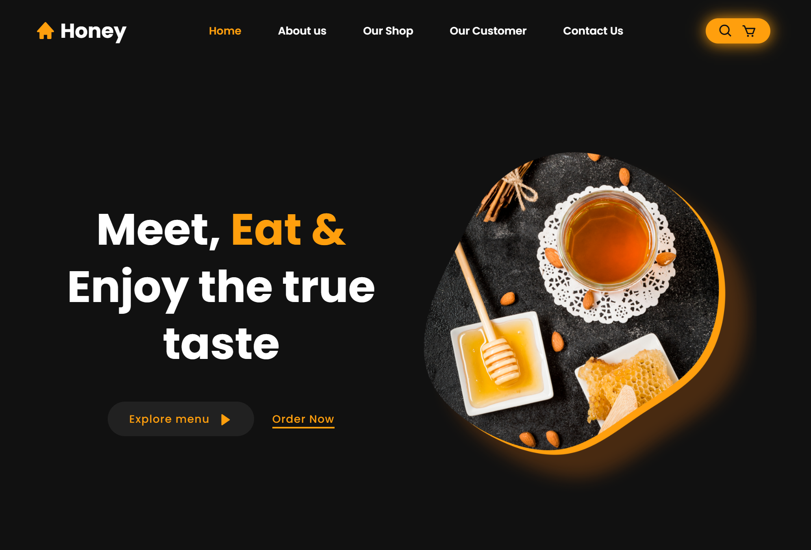

# Honey Website

Welcome to the **Honey Website** repository! 🍯

## About

This project is a modern React + Vite website concept for a honey-based shop.

**This is a purely front-end website**—there is no backend or database. All content, layout, and interactivity are handled on the client side using React components.  
The design is ideal for a honey-themed restaurant, food-product pages, or similar culinary/product-based sites.

## Live Preview

[https://7sg56.github.io/honey-store/](https://7sg56.github.io/honey-store/)

## Preview



## Tech Stack

- [React](https://react.dev/)
- [Vite](https://vitejs.dev/)
- [Boxicons](https://boxicons.com/) (for icons)

## Status

✅ **Completed**

The project is now complete and stable. A live preview is available. All planned features and enhancements have been implemented.

## Usage

1. Clone the repository.
2. Install dependencies:
   ```sh
   npm install
   ```
3. Start the development server:
   ```sh
   npm run dev
   ```
4. Build for production:
   ```sh
   npm run build
   ```

## Contributing

Contributions are welcome! Please open an issue or pull request if you'd like to help improve the project.

